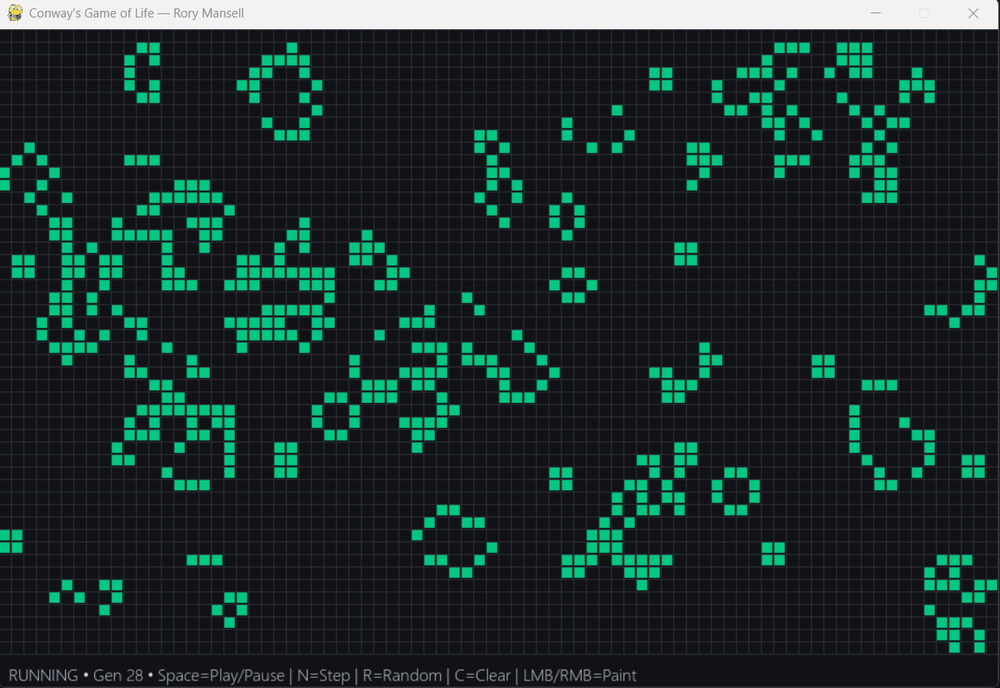

# Conway’s Game of Life 🟩

An interactive Python implementation of [Conway’s Game of Life](https://en.wikipedia.org/wiki/Conway%27s_Game_of_Life) — a cellular automaton where simple rules create complex emergent behavior.  

Built with **Pygame**, packaged into a standalone **.exe** using **PyInstaller**, so it can be played without installing Python.

---

## 🎥 Demo



---

## 🚀 Features
- Classic Game of Life rules:
  - Any live cell with 2–3 neighbors survives
  - Any dead cell with 3 neighbors becomes alive
  - All other cells die/stay dead
- Pause/play simulation
- Randomize grid at startup
- Adjustable grid size & speed in code
- Packaged into a `.exe` for easy play on Windows

---

## ▶️ Download
Grab the latest Windows build from the [Releases page](https://github.com/roryMansell/life-game/releases).

## 🛠️ Run Locally

Clone and install:
```bash
git clone https://github.com/roryMansell/life-game.git
cd life-game
pip install -r requirements.txt
